```python
import torch
import torch.nn as nn
import os
import pandas as pd
import skimage as sk
from skimage import io as skio, transform
import numpy as np
import matplotlib.pyplot as plt
from torch.utils.data import Dataset, DataLoader
from torchvision import transforms, utils
import time
```


```python
class Rescale(object):
    """Rescale the image in a sample to a given size.

    Args:
        output_size (tuple or int): Desired output size. If tuple, output is
            matched to output_size. If int, smaller of image edges is matched
            to output_size keeping aspect ratio the same.
    """

    def __init__(self, output_size):
        assert isinstance(output_size, (int, tuple))
        self.output_size = output_size

    def __call__(self, sample):
        image, landmarks = sample['image'], sample['pts']

        h, w = image.shape[:2]
        if isinstance(self.output_size, int):
            if h > w:
                new_h, new_w = self.output_size * h / w, self.output_size
            else:
                new_h, new_w = self.output_size, self.output_size * w / h
        else:
            new_h, new_w = self.output_size

        new_h, new_w = int(new_h), int(new_w)

        img = transform.resize(image, (new_h, new_w))

        # h and w are swapped for landmarks because for images,
        # x and y axes are axis 1 and 0 respectively
        landmarks = landmarks * [new_w / w, new_h / h]
        sample['image'] = img
        sample['pts'] = landmarks
        return sample
```


```python
class ToTensor(object):
    """Convert ndarrays in sample to Tensors."""

    def __call__(self, sample):
        image, landmarks = sample['image'], sample['pts']

        # swap color axis because
        # numpy image: H x W x C
        # torch image: C X H X W
#         image = image.transpose((2, 0, 1))
        image = torch.from_numpy(image)
        image = torch.unsqueeze(image, 0)
        sample['image'] = image
        sample['pts'] = torch.from_numpy(landmarks)
        return sample
```


```python
class FacePointsDataset(Dataset):
    def __init__(self, dir_path, transform=None, val=False, nose=True):
        self.dir_path = dir_path
        self.nose = nose
        self.transform = transform
        self.img_filenames = sorted(self.get_img_filenames())
        if val:
            self.img_filenames = self.img_filenames[191:]
        else:
            self.img_filenames = self.img_filenames[:191]
        self.items = [self.get(index) for index in range(len(self.img_filenames))]

    def get(self, index):
        if index >= len(self.img_filenames):
            return None
        file = 'imm_face_db/' + self.img_filenames[index]
        im = skio.imread(file, as_gray=True)
        im = (sk.img_as_float32(im)) - 0.5
        h, w = im.shape[:2]
        asf_file_name = file.replace(".jpg", ".asf")
        tmp_pts = np.genfromtxt(asf_file_name, skip_header=10, skip_footer=1, usecols=(2,3))
        tmp_pts = np.array([[i[0]*w, i[1]*h] for i in tmp_pts])
        if self.nose:
            tmp_pts = tmp_pts[52]
        ans = {'image': im, 'pts': tmp_pts, 'h': h, 'w': w}
        if self.transform:
            ans = self.transform(ans)
        return ans

    def get_img_filenames(self):
        return [file for file in os.listdir(self.dir_path) if file.endswith(".jpg")]
    
    def __len__(self):
        return len(self.img_filenames)

    def __getitem__(self, index):
        return self.items[index]
        
```


```python
# Part 1 Dataloader
dataset = FacePointsDataset('imm_face_db', transforms.Compose([Rescale((60,80)), ToTensor()]))
dataloader = DataLoader(dataset)
```


```python
# Sample and display a couple of images with the nose keypoint
count = 0
for i_batch, sample_batched in enumerate(dataloader):
    plt.figure()
    plt.imshow(sample_batched['image'][0][0], cmap='gray')
    plt.scatter(sample_batched['pts'][0][0], sample_batched['pts'][0][1], s=10, marker='.', c='r')
    plt.show()
    count += 1
    if count > 3:
        break

```


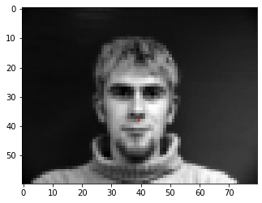


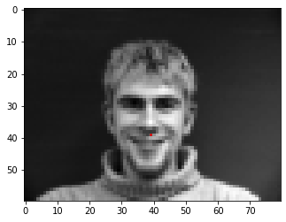


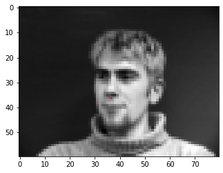


```python
class NosePrintLayer(nn.Module):
    def __init__(self):
        super(NosePrintLayer, self).__init__()
    
    def forward(self, x):
#         print(x.shape)
        return x
```


```python
class ViewLayer(nn.Module):
    def __init__(self):
        super(ViewLayer, self).__init__()
    
    def forward(self, x):
        x = x.view(1, -1)
        return x
```


```python
# Define CNN for just the Nose Keypoint
class NoseNet(nn.Module):
    def __init__(self):
        super(NoseNet, self).__init__()
        self.channels = 20
        self.kernel_size = 3
        pad = 1
        stride = 1
        self.layers = nn.Sequential(
            nn.Conv2d(1, self.channels, self.kernel_size, padding=pad, stride=stride),
            NosePrintLayer(),
            nn.ReLU(inplace=True),
            nn.MaxPool2d(2),
            nn.Conv2d(self.channels, self.channels*2, self.kernel_size, padding=pad, stride=stride),
            NosePrintLayer(),
            nn.ReLU(inplace=True),
            nn.MaxPool2d(2),
            nn.Conv2d(self.channels*2, self.channels*3, self.kernel_size, padding=pad, stride=stride), 
            NosePrintLayer(),
            nn.ReLU(inplace=True),
            nn.MaxPool2d(2),
            # Not sure about input size here
            ViewLayer(),
            nn.Linear(self.channels*210, 500),
            NosePrintLayer(),
            nn.ReLU(inplace=True),
            nn.Linear(500, 2),
            NosePrintLayer(),
        )

    def forward(self, x):
        x = self.layers(x)
        return x


```


```python
# Define loss_fn
loss_fn = nn.MSELoss(reduction='sum')
```


```python
def nose_train(net, optimizer, dataloader, loss_fn):
    total_loss = 0
    net = net.train()
    cnt = 0
    for i_batch, sample_batched in enumerate(dataloader):
        im = sample_batched['image']
        pts = sample_batched['pts']
        optimizer.zero_grad()
        output = net(im)
        loss = loss_fn(output, pts)
        loss.backward()
        optimizer.step()
        total_loss += loss.item()
        cnt += 1
    return total_loss/cnt
```


```python
def display_im(im, pred_pts, act_pts, h, w):
    print(pred_pts)
    print(act_pts)
    plt.figure()
    plt.imshow(im[0][0], cmap='gray')
    plt.scatter(pred_pts[0][0], pred_pts[0][1], s=10, marker='.', c='r')
    plt.scatter(act_pts[0][0], act_pts[0][1], s=10, marker='.', c='g')
    plt.show()
```


```python
def nose_validation(net, dataloader, loss_fn, epoch):
    losses = 0
    cnt = 0
    with torch.no_grad():
        net = net.eval()
        for i_batch, sample_batched in enumerate(dataloader):
            im = sample_batched['image']
            pts = sample_batched['pts']
            h = sample_batched['h']
            w = sample_batched['w']
            output = net(im)
            if epoch == 14 and cnt < 7:
                display_im(im, output, pts, h, w)
            loss = loss_fn(output, pts)
            losses += loss.item()
            cnt += 1
    print(losses/cnt)
    return losses/cnt
```


```python
# Training code for epochs
train_dataset = FacePointsDataset('imm_face_db', transforms.Compose([Rescale((60,80)), ToTensor()]))
train_dataloader = DataLoader(train_dataset)

val_dataset = FacePointsDataset('imm_face_db', transforms.Compose([Rescale((60,80)), ToTensor()]), val=True)
val_dataloader = DataLoader(val_dataset)
```


```python
net = NoseNet()
net = net.double()
learning_rate = 1e-3
optimizer = torch.optim.Adam(net.parameters(), lr=learning_rate)
start = time.time()
train_losses = []
val_losses = []
for epoch in range(15):
    train_losses.append(nose_train(net, optimizer, train_dataloader, loss_fn))
    val_losses.append(nose_validation(net, val_dataloader, loss_fn, epoch))
end = time.time()
print("time= " + str(end-start))
```

    68.89746756247808
    70.83524602179548
    72.95282477201539
    74.15723651643022
    72.24156333415732
    69.12214503607782
    49.01586174113831
    40.13184008068541
    34.54396202542646
    30.78266506651454
    29.01215015854005
    33.66649767441947
    29.343262469838667
    23.195295994792055
    tensor([[33.5334, 37.2719]], dtype=torch.float64)
    tensor([[31.6754, 37.3988]], dtype=torch.float64)


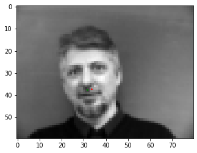


    tensor([[33.8753, 35.7267]], dtype=torch.float64)
    tensor([[35.6270, 38.5274]], dtype=torch.float64)


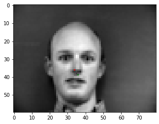


    tensor([[32.6340, 35.5742]], dtype=torch.float64)
    tensor([[33.7722, 39.4948]], dtype=torch.float64)


    tensor([[28.0066, 33.2050]], dtype=torch.float64)
    tensor([[19.9012, 37.3181]], dtype=torch.float64)


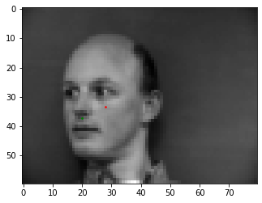


    tensor([[32.6047, 34.2527]], dtype=torch.float64)
    tensor([[40.7077, 35.9476]], dtype=torch.float64)


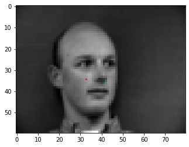


    tensor([[29.2060, 34.5380]], dtype=torch.float64)
    tensor([[31.6754, 37.6325]], dtype=torch.float64)


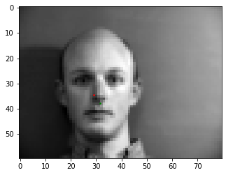


    tensor([[28.5133, 33.4105]], dtype=torch.float64)
    tensor([[20.4657, 36.9957]], dtype=torch.float64)


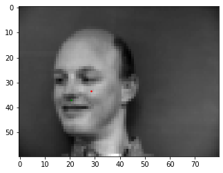


    19.28369348974175
    time= 272.11017394065857


```python
plt.plot(range(15), train_losses, label='Training Loss')
plt.plot(range(15), val_losses, label='Val Loss')
plt.legend()
plt.xlabel('Epochs')
plt.ylabel('Loss')
plt.title('Loss during Training and Validation over Time')
```


    Text(0.5, 1.0, 'Loss during Training and Validation over Time')


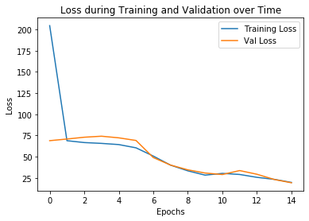


```python
print(train_losses)
```

    [204.44999779324695, 68.87481945516865, 66.6757960724981, 65.69243803098264, 64.30433001275945, 60.46244834119344, 50.75291797165245, 40.047779973875315, 33.34770232330853, 28.28787417782181, 30.355557530382107, 29.07051401025887, 25.704256924373095, 23.337992742406133, 19.683450609067282]


#### It fails for the images where the face is angled. This may be due to the limited amount of training data, due to which the model is unable to handle outlier cases where the head is angled in an unexpected way


```python
# Part 2: Full Facial Keypoints Detection
full_dataset = FacePointsDataset('imm_face_db', transforms.Compose([Rescale((120,160)), ToTensor()]), nose=False)
full_dataloader = DataLoader(full_dataset)
```


```python
# Sample and display a couple of images with all the keypoints
count = 0
for i_batch, sample_batched in enumerate(full_dataloader):
    plt.figure()
    plt.imshow(sample_batched['image'][0][0], cmap='gray')
    plt.scatter(sample_batched['pts'][0][:,0], sample_batched['pts'][0][:,1], s=10, marker='.', c='r')
    plt.show()
    count += 1
    if count > 3:
        break
```


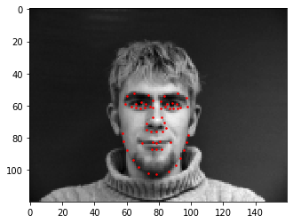


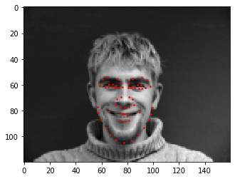


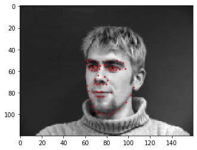


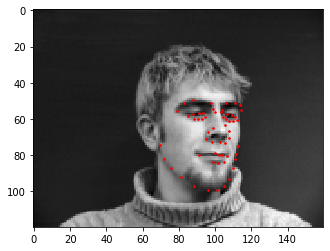


```python
# Define CNN for full face
class FullNet(nn.Module):
    def __init__(self):
        super(FullNet, self).__init__()
        self.channels = 15
        self.kernel_size = 3
        pad = 1
        stride = 1
        self.layers = nn.Sequential(
            nn.Conv2d(1, self.channels, self.kernel_size, padding=pad, stride=stride),
            PrintLayer(),
            nn.ReLU(inplace=True),
            nn.MaxPool2d(2),
            nn.Conv2d(self.channels, self.channels*2, self.kernel_size, padding=pad, stride=stride),
            PrintLayer(),
            nn.ReLU(inplace=True),
            nn.MaxPool2d(2),
            nn.Conv2d(self.channels*2, self.channels*4, self.kernel_size, padding=pad, stride=stride), 
            PrintLayer(),
            nn.ReLU(inplace=True),
            nn.MaxPool2d(2),
            nn.Conv2d(self.channels*4, self.channels*8, self.kernel_size, padding=pad, stride=stride), 
            PrintLayer(),
            nn.ReLU(inplace=True),
            nn.MaxPool2d(2),
            nn.Conv2d(self.channels*8, self.channels*16, self.kernel_size, padding=pad, stride=stride), 
            PrintLayer(),
            nn.ReLU(inplace=True),
            nn.MaxPool2d(2),
            # Not sure about input size here
            ViewLayer(),
            nn.Linear(3600, 2000),
            PrintLayer(),
            nn.ReLU(inplace=True),
            nn.Linear(2000, 600),
            nn.ReLU(inplace=True),
            nn.Linear(600, 116),
            PrintLayer(),
        )

    def forward(self, x):
        x = self.layers(x)
        return x
```


```python
def full_train(net, optimizer, dataloader, loss_fn):
    total_loss = 0
    net = net.train()
    cnt = 0
    for i_batch, sample_batched in enumerate(dataloader):
        im = sample_batched['image']
        pts = sample_batched['pts']
        optimizer.zero_grad()
        output = net(im)
        output = output.view(58, -1)
        output = torch.unsqueeze(output, 0)
        loss = loss_fn(output, pts)
        loss.backward()
        optimizer.step()
        total_loss += loss.item()
        cnt += 1
    return total_loss/cnt
```


```python
def full_validation(net, dataloader, loss_fn, epoch):
    losses = 0
    cnt = 0
    with torch.no_grad():
        net = net.eval()
        for i_batch, sample_batched in enumerate(dataloader):
            im = sample_batched['image']
            pts = sample_batched['pts']
            h = sample_batched['h']
            w = sample_batched['w']
            output = net(im)
            output = output.view(58, -1)
            output = torch.unsqueeze(output, 0)
            if epoch == 24 and cnt < 7:
                full_display_im(im, output, pts, h, w)
            loss = loss_fn(output, pts)
            losses += loss.item()
            cnt += 1
    print(losses/cnt)
    return losses/cnt
```


```python
def full_display_im(im, pred_pts, act_pts, h, w):
#     pred_pts = np.array([[i[0]*w, i[1]*h] for i in pred_pts[0]])
#     act_pts = np.array([[i[0]*w, i[1]*h] for i in act_pts[0]])
    plt.figure()
    plt.imshow(im[0][0], cmap='gray')
    plt.scatter(pred_pts[0][:,0], pred_pts[0][:,1], s=10, marker='.', c='r')
    plt.scatter(act_pts[0][:,0], act_pts[0][:,1], s=10, marker='.', c='g')
    plt.show()
```


```python
# Training code for epochs
full_train_dataset = FacePointsDataset('imm_face_db', transforms.Compose([Rescale((120,160)), ToTensor()]), nose=False)
full_train_dataloader = DataLoader(full_train_dataset)

full_val_dataset = FacePointsDataset('imm_face_db', transforms.Compose([Rescale((120,160)), ToTensor()]), nose=False, val=True)
full_val_dataloader = DataLoader(full_val_dataset)
```


```python
class ViewLayer(nn.Module):
    def __init__(self):
        super(ViewLayer, self).__init__()
    
    def forward(self, x):
        x = x.view(1, -1)
        return x

class PrintLayer(nn.Module):
    def __init__(self):
        super(PrintLayer, self).__init__()

    def forward(self, x):
    #         print(x.shape)
        return x
```


```python
net = FullNet()
net = net.double()
learning_rate = 1e-4
optimizer = torch.optim.Adam(net.parameters(), lr=learning_rate)
start = time.time()
train_losses = []
val_losses = []
for epoch in range(25):
    train_losses.append(full_train(net, optimizer, full_train_dataloader, loss_fn))
    val_losses.append(full_validation(net, full_val_dataloader, loss_fn, epoch))
end = time.time()
print("time= " + str(end-start))
```

    10277.635815985197
    10259.439792415113
    10280.715439319598
    10297.321636761742
    10305.253207267831
    10297.527317827213
    10289.551964096869
    10279.81642136879
    10268.289543618737
    10255.453439330997
    10241.981234964094
    10228.789042135177
    10214.679103259543
    10200.874410439092
    10186.628048725708
    10172.820336480243
    10160.397732513857
    10145.96004153762
    10127.367902947957
    10103.856107137644
    10081.065582509704
    10058.20001137063
    10038.240250932866
    10010.611846148562


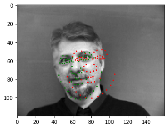


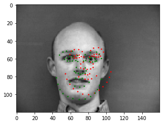


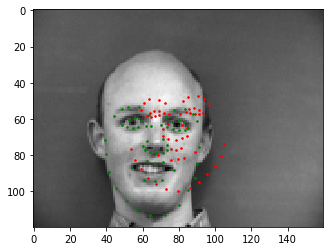


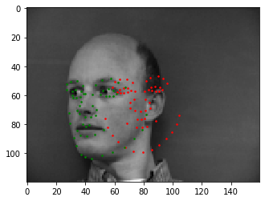


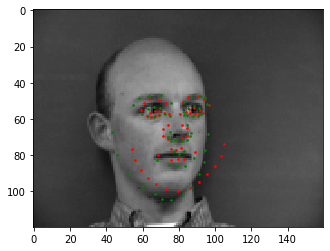


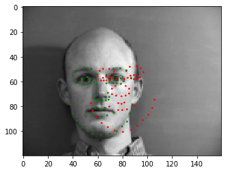


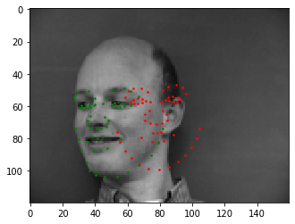


    9980.340262771178
    time= 1139.5175280570984


```python
# Part 3: Train with Larger Dataset


```
