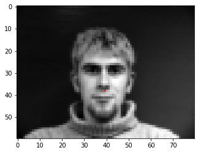

# Part 1 Dataloader
In this part, we had to detect the nose keypoint. Here are some of the ground truth keypoints:

For the model, I used a learning rate of `1e-3`, batch size of 1, `20` input channels, a kernel size of `3` and 15 epochs for training and validation.

### Good Results

### Bad Results

It fails for the images where the face is angled. This may be due to the limited amount of training data, due to which the model is unable to handle outlier cases where the head is angled in an unexpected way

#### Plot of training and validation errors over the epochs

# Part 2: Full Facial Keypoints Detection

Now, we try to predict all the facial keypoints. Here are the ground truth labels:

For the model, I used a learning rate of `1e-3`, `25` epochs, `15` input channels with a kernel size of `3x3` and batch size of 1. I used 5 `Conv2d` layers, each followed by a `ReLU` and pooling layer, and then 3 Fully Connected Layers.

#### Plot of training and validation errors over the epochs

### Good Results

### Bad Results

The predicted points are fairly similar across faces, due to which some faces work pretty well and others do not. This is because the model is overfit to the training data and is too rigid and can be rectified by increasing the amount of training data the model has available.

# Part 3: Train with Larger Dataset

Now we try to predict the keypoints using a much larger training set and the ResNet18 model that comes preloaded into PyTorch. Here are
some of the ground truth labels.

For this model, I used a kernel size of `7x7`, `30` epochs of training and 1 input channel.
Here are some of the resulting predictions:

